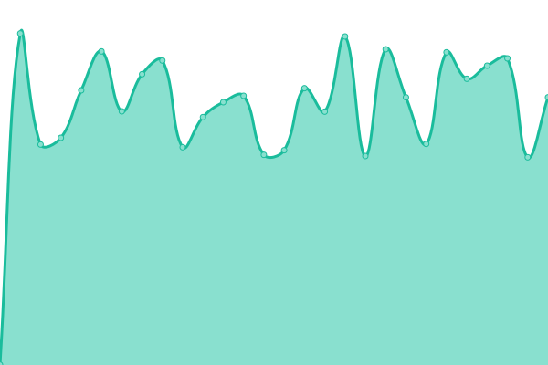
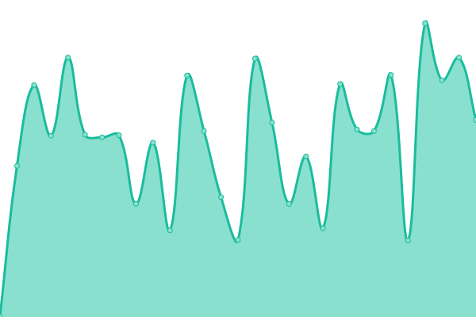
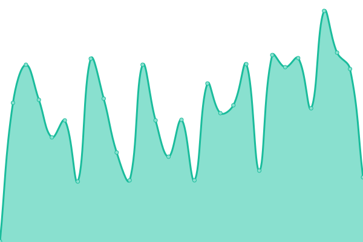
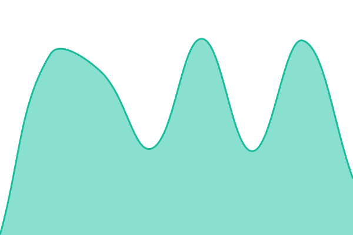

# [📈 Live Status](https://rocketman.github.io/KZSU-Music-Beatcheck/): <!--live status--> **🟩 All systems operational**

This repository contains the open-source uptime monitor and status page for [KZSU Music Beatcheck](https://rocketman.github.io/KZSU-Music-Beatcheck/), powered by [Upptime](https://github.com/upptime/upptime), monitor for [KZSU Music](https://zookeeper.stanford.edu/).

With [Upptime](https://upptime.js.org), you can get your own unlimited and free uptime monitor and status page, powered entirely by a GitHub repository. We use [Issues](https://github.com/RocketMan/KZSU-Music-Beatcheck/issues) as incident reports, [Actions](https://github.com/RocketMan/KZSU-Music-Beatcheck/actions) as uptime monitors, and [Pages](https://rocketman.github.io/KZSU-Music-Beatcheck/) for the status page.

<!--start: status pages-->
<!-- This summary is generated by Upptime (https://github.com/upptime/upptime) -->
<!-- Do not edit this manually, your changes will be overwritten -->
<!-- prettier-ignore -->
| URL | Status | History | Response Time | Uptime |
| --- | ------ | ------- | ------------- | ------ |
|  [KZSU](https://kzsu.stanford.edu/) | 🟩 Up | [kzsu.yml](https://github.com/RocketMan/KZSU-Music-Beatcheck/commits/HEAD/history/kzsu.yml) | 

 595ms
     
 | 

<a href="https://RocketMan.github.io/KZSU-Music-Beatcheck/history/kzsu">100.00%</a>
    

|  [KZSU Music](https://zookeeper.stanford.edu/) | 🟩 Up | [kzsu-music.yml](https://github.com/RocketMan/KZSU-Music-Beatcheck/commits/HEAD/history/kzsu-music.yml) | 

 408ms
     
 | 

<a href="https://RocketMan.github.io/KZSU-Music-Beatcheck/history/kzsu-music">100.00%</a>
    

|  [KZSU Streams](https://kzsu-streams.stanford.edu/) | 🟩 Up | [kzsu-streams.yml](https://github.com/RocketMan/KZSU-Music-Beatcheck/commits/HEAD/history/kzsu-streams.yml) | 

 223ms
     
 | 

<a href="https://RocketMan.github.io/KZSU-Music-Beatcheck/history/kzsu-streams">100.00%</a>
    

|  [KZSU Zootopia](http://kzsu.rocks/) | 🟩 Up | [kzsu-zootopia.yml](https://github.com/RocketMan/KZSU-Music-Beatcheck/commits/HEAD/history/kzsu-zootopia.yml) | 

 726ms
     
 | 

<a href="https://RocketMan.github.io/KZSU-Music-Beatcheck/history/kzsu-zootopia">100.00%</a>
    

<!--end: status pages-->

[**Visit our status website →**](https://rocketman.github.io/KZSU-Music-Beatcheck/)

## 📄 License

- Powered by: [Upptime](https://github.com/upptime/upptime)
- Code: [MIT](./LICENSE) © [Anand Chowdhary](https://anandchowdhary.com), supported by [Pabio](https://pabio.com)
- Data in the `./history` directory: [Open Database License](https://opendatacommons.org/licenses/odbl/1-0/)
